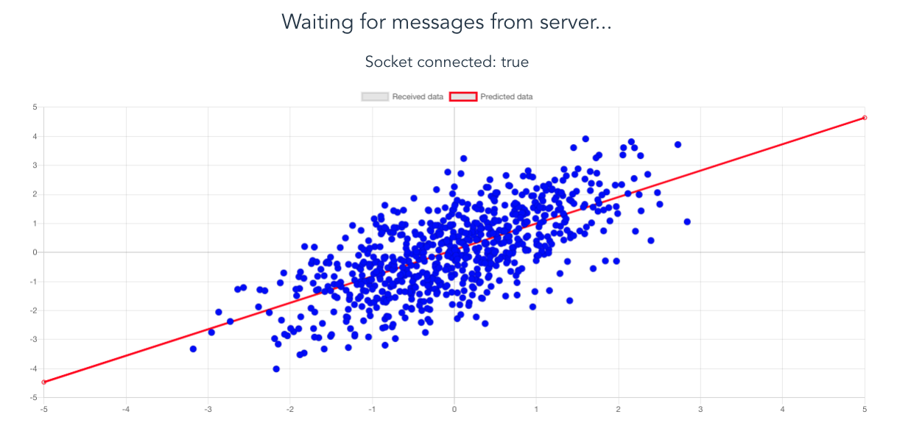

# Example of online training with Tensorflow.js

<p align="center">

</p>

## Instructions

### Client

```sh
cd client && npm install && npm run dev
```

### Server

```sh
cd server && npm install && npm start
```
